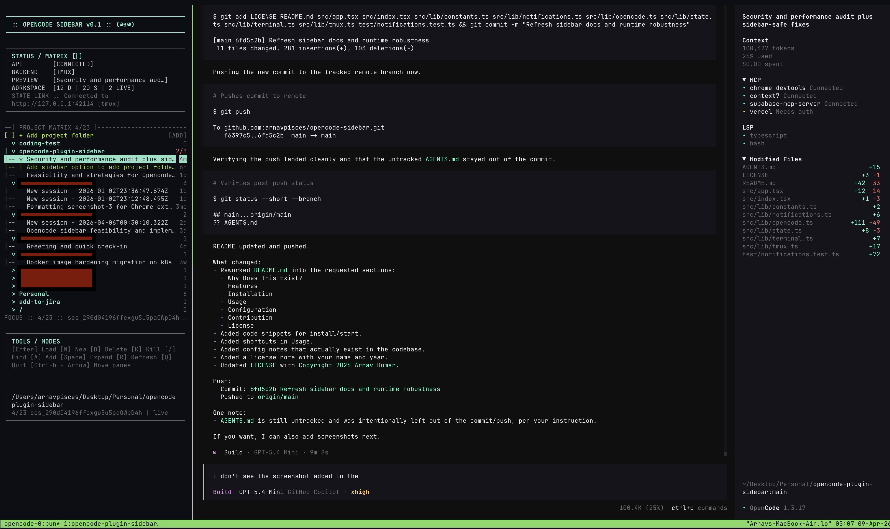

# OpenCode Sidebar

Tmux sidebar launcher for `opencode`.

## Why Does This Exist?

OpenCode is easier to use when the session list, preview pane, and TUI stay together. This launcher keeps them in one tmux session so you can move between the sidebar and OpenCode without losing context.

## Features

- Left pane for projects and sessions
- Right pane for the stock OpenCode TUI
- Enter-based session recall into preview
- Background active sessions
- Session deletion from the sidebar
- Sound notifications when OpenCode needs input or finishes work
- Automatic cleanup of parked `opencode attach` panes

## Quick Start

### Prerequisites
- `tmux`
- `bun`

Make sure both are installed and available in your PATH.

Then run-
```bash
git clone https://github.com/arnavpisces/opencode-sidebar.git
cd opencode-sidebar
bun install
./bin/opencode-sidebar-tmux
```

## Usage



### Shortcuts

- `↑` / `↓`: move
- `Enter`: load or recall the selected session into preview
- `n`: new session
- `d`: delete session with confirmation
- `k`: kill a running session window without deleting history
- `/`: search
- `a`: add a project folder
- `Space`: expand or collapse a project
- `Ctrl-b` then arrow keys: switch between the sidebar and the OpenCode pane
- `q`: quit

### Status Symbols

- `▶` means currently previewed
- `◆` means active in background
- `[*]` means a session recently completed work and still has unread completion state

## Configuration

- `OPENCODE_SIDEBAR_DIR`: override the local state and log directory
- `OPENCODE_SIDEBAR_NOTIFY=0`: disable sounds
- `OPENCODE_SIDEBAR_NOTIFY_ATTENTION_SOUND`: custom sound for questions and approval requests
- `OPENCODE_SIDEBAR_NOTIFY_COMPLETE_SOUND`: custom sound for completion
- Sound values can be a system sound name like `Glass` or `Ping`, or a full path such as `~/Music/done.aiff`
- `OPENCODE_SIDEBAR_TEST_CONTROL`: test-only file that `src/index.tsx` polls for `open:` and `new:` commands

## Contribution

Pull requests and opening issues are welcome. For details, see:
- [CONTRIBUTING.md](./CONTRIBUTING.md)
- [.github/ISSUE_TEMPLATE/bug_report.md](./.github/ISSUE_TEMPLATE/bug_report.md)
- [.github/pull_request_template.md](./.github/pull_request_template.md)

### How to contribute
- Fork the repository
- Create a new branch (`feature/...` or `fix/...`)
- Make your changes
- Commit with a clear message
- Open a Pull Request

### Guidelines

- Keep PRs small and focused
- Write clear, descriptive commit messages
- Ensure your changes do not break existing functionality
- Add comments where needed

## License

Apache-2.0 © 2026 Arnav Kumar
---
If this repo helped you, consider giving it a ⭐. Happy Vibing :)
